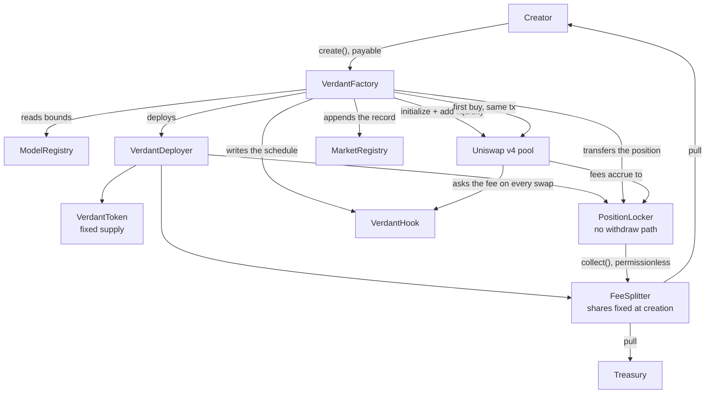

# Architecture

Fourteen contracts, no proxies, and one transaction that has to either do all of
it or none of it.

This document is the map. The reasoning behind individual choices lives in
[`docs/decisions/`](docs/decisions/), which is where to go when the question is
"why on earth is it done that way".

## The shape of a launch



Everything above happens inside one call. If any part reverts, all of it does,
so there is no reachable state where a token exists without its pool or a pool
exists without its liquidity locked.

## The contracts

**Deployed once, shared by every market.**

| Contract | What it is for |
| --- | --- |
| [`FactoryOrigin`](packages/contracts/src/FactoryOrigin.sol) | Creates the factory exactly once, at an address derived from itself. It is why the factory's address can be an anchor rather than a configuration value — [ADR-007](docs/decisions/007-the-factory-address-is-anchored.md). |
| [`VerdantFactory`](packages/contracts/src/VerdantFactory.sol) | The whole launch, atomically. The only contract a creator calls. |
| [`VerdantHook`](packages/contracts/src/VerdantHook.sol) | Answers Uniswap's question "what does this swap cost", per pool, from an immutable schedule. Implements `IHooks` directly rather than extending `BaseHook` — [ADR-004](docs/decisions/004-ihooks-not-basehook.md). |
| [`VerdantDeployer`](packages/contracts/src/VerdantDeployer.sol) | Holds the bytecode of the per-market contracts, so the factory can stay under the size limit while still deploying them itself. |
| [`ModelRegistry`](packages/contracts/src/ModelRegistry.sol) | The bounds a new market must satisfy, and which quote assets are admissible. Read at creation, never again. |
| [`MarketRegistry`](packages/contracts/src/MarketRegistry.sol) | Append-only. The canonical answer to "is this a Verdant market, and what was it created as". |

**Deployed per market, by the launch itself.**

| Contract | What it is for |
| --- | --- |
| [`VerdantToken`](packages/contracts/src/VerdantToken.sol) | Fixed supply, ERC-20 with permit, and nothing else. No mint, no owner, no tax, no blocklist, no pause. |
| [`FeeSplitter`](packages/contracts/src/FeeSplitter.sol) | Holds the creator/protocol split, fixed at creation, and pays each party only on their own pull. |
| [`PositionLocker`](packages/contracts/src/PositionLocker.sol) | Owns the launch position forever. Its only outbound path sends collected fees to the splitter. |
| [`TokenVesting`](packages/contracts/src/TokenVesting.sol) | Linear release after a cliff, for one beneficiary, where a creator allocation is vested. |

**Libraries.**

| Library | What it is for |
| --- | --- |
| [`ScheduleLib`](packages/contracts/src/libraries/ScheduleLib.sol) | A fee schedule of up to eight stages, packed into two storage words, with the validation and evaluation that go with it. |
| [`LaunchBounds`](packages/contracts/src/libraries/LaunchBounds.sol) | The creation-time bound constants. |
| [`VerdantConstants`](packages/contracts/src/libraries/VerdantConstants.sol) | Protocol-wide constants that are frozen by definition. |

**Deployed, and deliberately not wired up.**
[`FeeForwarder`](packages/contracts/src/FeeForwarder.sol) and
[`FeeForwarderFactory`](packages/contracts/src/FeeForwarderFactory.sol) would let
a creator's fees be pushed by anyone rather than claimed by the creator. The
factory exists on chain; the switch in config is off. See
[SECURITY.md](SECURITY.md#open-gaps).

## Four properties the design is built around

**Bounds live in contracts, not in the interface.** Every limit is enforced on
chain and re-validated by the hook. `packages/config/src/bounds.ts` is the single
source those bounds are transcribed from, and the SDK re-reads the on-chain
values at runtime and warns on drift. A bound that exists only in the interface
is not a bound; it is a suggestion to anyone who can send a transaction.

**The preview is the transaction.** Anything shown before signing is computed by
the code path that will execute. Where a value is computed in both Solidity and
TypeScript, the two are held to shared vectors whose expected values come from a
third, naive implementation — so a misconception shared by the two
implementations under test cannot pass. Two implementations that can disagree is
the entire bug class those vectors exist to prevent.

**The hook never holds value.** Mined for `0x3880` and no delta-returning bit.
It cannot take custody during a swap because Uniswap will not call it in a way
that allows it. See [SECURITY.md](SECURITY.md#what-cannot-be-changed).

**Never `block.number`.** On this chain it returns the L1 block number, which
advances about 119× slower than the L2 clock. All timing is `block.timestamp`.

## Off chain

Three things read the chain and none of them can affect it.

| Part | Role |
| --- | --- |
| [`packages/sdk`](packages/sdk) | TypeScript twins of the on-chain math, generated ABIs, and the read and write helpers the interface uses. |
| [`apps/indexer`](apps/indexer) | A Ponder indexer and the API the interface reads for market lists, charts, holders and trades. |
| [`apps/web`](apps/web) | The interface. Explore, market pages, launch forms and in-app documentation. |

The indexer is a convenience, not a dependency of correctness. `pnpm proof`
stands up a chain, launches six markets, trades across a fee transition,
collects and claims, and then requires the indexer's answers to equal the
contracts' own — because a launchpad whose displayed numbers come from a
database is only as trustworthy as the assertion that the database agrees with
the chain. With no feed reachable the interface still builds and renders, and it
says the feed is unavailable, which is deliberately a different statement from
saying that no markets exist.

## Reproducing the deployment

```bash
pnpm contracts:deps      # pinned Solidity dependencies
pnpm contracts:build     # solc 0.8.26, optimizer 1_000_000 runs, cancun
pnpm verify:deployment   # published hashes against the chain's own codeHash
```

Dependencies are pinned to the commits matching the bytecode already deployed on
4663, established by a byte-for-byte source diff rather than by tracking
upstream `main`, which has since diverged.
