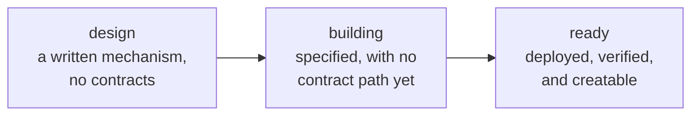

# Launch models

A launch model is a shape of market: what a token is paired against, how the
swap fee is charged, which currency the creator earns in, and who can ever touch
the launch position.

Every model here is generated from
[`packages/config/src/launch-models.ts`](packages/config/src/launch-models.ts) —
the same data the interface renders. `pnpm verify:models` fails if this page's
machine-readable twin and that file ever disagree, so a model cannot be
advertised as live here while the product treats it as a design.

| Model | Status | Quoted in | Record |
| --- | --- | --- | --- |
| [Classic](models/classic/README.md) | **Live** | Ether | [`model.json`](models/classic/model.json) |
| [Stock-Paired](models/stock-paired/README.md) | **Live** | A reviewed tokenized equity | [`model.json`](models/stock-paired/model.json) |
| [Evergreen](models/evergreen/README.md) | Design | Ether | [`model.json`](models/evergreen/model.json) |

The index is [`models/registry.json`](models/registry.json).

## The lifecycle

Three states, and only one of them is a button:

- **`design`** — a mechanism written down and nothing else. The factory will
  refuse it.
- **`building`** — the interface and specification exist; the contract path does
  not. The factory will still refuse it.
- **`ready`** — deployed on Robinhood Chain, checked against it, and creatable.

The status field describes **contract readiness, never interface readiness**,
because a form that accepts input for a contract that cannot execute it is worse
than a form that is absent. Anything short of `ready` has to state what remains,
and `pnpm verify:models` enforces that: a non-live model with an empty
`remaining` list fails the build. The gate for reaching `ready` is
[RELEASING.md](RELEASING.md).

## Fee models

A creator picks a launch model first — ether or an equity — and a fee model
inside it. Keeping the two apart is what lets one fee schedule apply to both pair
types without duplicating either idea.

**Fixed.** One fee stage, constant for the life of the market, set at creation.

**Progressive.** Two to eight stages. Stage *n* activates at the pool's
initialization time plus that stage's offset in seconds, and the active fee is
the one belonging to the latest stage whose offset has elapsed. The schedule is
immutable and derives only from `block.timestamp`. There is no discretion, no
oracle and no off-chain trigger — nothing "runs" a transition; the hook is simply
asked what the fee is and answers.

Both live in two storage words. Reading one on the swap path costs 7 186 gas and
one storage slot for four stages or fewer.

## Where the fee actually lands

Worth stating on its own, because it surprises people and most launchpads are
vague about it.

The fee is charged by **Uniswap**, taken from the currency going *into* the pool.
It is not skimmed by the hook. So a buy pays the fee in the quote asset and a
sell pays it in the launched token, and a creator's earnings are a mixture of
both rather than a single currency.

Those fees accrue to the locked position. `collect()` on the locker is
permissionless — anyone may call it, because the only place the locker can send
anything is the splitter. From there each party pulls their own share, and
neither can pull the other's.

## Adding a model

Verdant does not take third-party model submissions today. Saying so is more
useful than a review process nobody staffs.

What does exist: models are versioned independently, adding one cannot alter a
model already deployed, and the requirements a model must satisfy to be created
by the live factory are written down in [RELEASING.md](RELEASING.md) rather than
held as a maintainer's judgement. If you want to propose a mechanism, open a
discussion — the useful form is the one Evergreen is in, which is a mechanism
described precisely enough to argue with.
