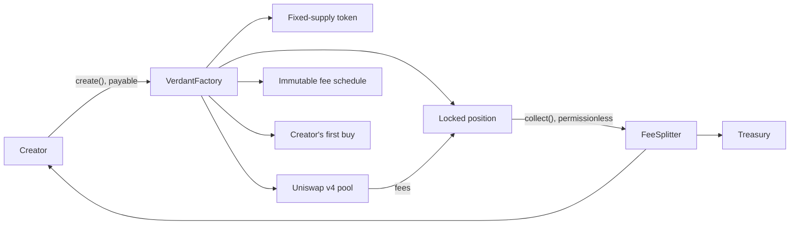

<p align="center">
  
</p>

<h1 align="center">Verdant</h1>

<p align="center"><strong>Create a token and its Uniswap v4 market in one transaction.</strong></p>

<p align="center">
  A market-creation layer on Robinhood Chain, where a market's behaviour is bounded by contracts rather than by an interface.
</p>

<p align="center">
  <a href="https://verdant.family"><strong>Launch</strong></a> ·
  <a href="MODELS.md">Models</a> ·
  <a href="ARCHITECTURE.md">Architecture</a> ·
  <a href="deployments/robinhood.json">Deployment</a> ·
  <a href="SECURITY.md">Security</a> ·
  <a href="docs/decisions/">Decisions</a>
</p>

<p align="center">
  <a href="https://github.com/verdantfamily/verdant.family/actions/workflows/ci.yml"></a>
  <a href="https://github.com/verdantfamily/verdant.family/actions/workflows/security.yml"></a>
  <a href="https://github.com/verdantfamily/verdant.family/actions/workflows/evidence.yml"></a>
  <a href="LICENSE"></a>
</p>

Verdant creates a fixed-supply token, an ether- or equity-quoted Uniswap v4 pool,
an immutable fee schedule and a permanently locked liquidity position — in a
single call that either does all of it or none of it.

**Live on Robinhood Chain (4663).** Broadcast on 2026-08-01 in blocks 25 393 021
to 25 393 023. Markets have been created through the interface, traded, and had
fees collected and claimed by their creator.

## Every claim here has a receipt

The uncomfortable thing about a launchpad is that all of its promises are about
what *cannot* happen, and a promise like that is indistinguishable from a
marketing sentence until someone can check it. So each row below names a command
you can run. None of them need a key, and the two chain-facing ones run on a
clean clone with no install step.

| The claim | What checks it |
| --- | --- |
| The published addresses are the code actually deployed | `pnpm verify:deployment` — compares every runtime code hash against the chain's own `codeHash` from the state trie |
| The deployed code is the source in this repository | all seven contracts are [fully verified on Blockscout](https://robinhoodchain.blockscout.com/address/0x661A5B2A8d7DC0EaEd98B335e070478b40B92Dd9?tab=contract) — a full match, not partial |
| The hook cannot take custody during a swap | the same command, from the hook's address alone; and [`Remappings.t.sol`](packages/contracts/test/Remappings.t.sol) against Uniswap's own flag constants |
| The launch position can never be withdrawn | [`PositionLocker.t.sol`](packages/contracts/test/PositionLocker.t.sol) |
| A fee schedule cannot be edited after creation | [`VerdantHook.t.sol`](packages/contracts/test/VerdantHook.t.sol) |
| Supply is fixed and there is no owner | [`VerdantToken.t.sol`](packages/contracts/test/VerdantToken.t.sol) |
| Each party can pull their fee share and only their own | [`FeeSplitter.t.sol`](packages/contracts/test/FeeSplitter.t.sol) |
| The models advertised here are the models the product will build | `pnpm verify:models` — [`models/`](models/) is generated from the interface's own config |
| The preview equals the transaction | shared vectors, with expected values from a third naive implementation so a shared misconception cannot pass |
| The displayed market data equals the chain | `pnpm proof` — a real chain, six launches, an indexer, and the assertion that they agree |
| Static analysis is clean, and every suppression is argued for | [`docs/security/slither.md`](docs/security/slither.md) |
| All of the above, and 422 other things | `pnpm contracts:test` — plus 352 TypeScript tests under `pnpm test` |

Two of those run daily against the live chain, so if Robinhood moves something or
a published hash stops matching, the
[evidence badge](https://github.com/verdantfamily/verdant.family/actions/workflows/evidence.yml)
goes red without anyone pushing a commit.

## What one transaction does



If any step reverts, all of it does. There is no reachable state where a token
exists without its pool, or a pool exists without its liquidity locked. The
first buy is inside the same call so that a creator does not have to win a race
against everyone watching the mempool for their launch —
[ADR-009](docs/decisions/009-the-first-buy-is-part-of-the-launch.md).

The whole system is fourteen contracts and no proxies:
[ARCHITECTURE.md](ARCHITECTURE.md).

## The models

| Model | Status | Quoted in |
| --- | --- | --- |
| [Classic](models/classic/README.md) | **Live** | Ether |
| [Stock-Paired](models/stock-paired/README.md) | **Live** | A reviewed tokenized equity — NVIDIA, Apple, the S&P 500, silver |
| [Evergreen](models/evergreen/README.md) | Design | Ether |

A model's status describes **contract readiness, never interface readiness**,
because a form that accepts input for a contract that cannot execute it is worse
than a form that is absent. Anything short of live has to state what remains, and
CI fails if it does not. [MODELS.md](MODELS.md).

One thing worth knowing before reading further, because most launchpads are
vague about it: the fee is charged by **Uniswap**, from the currency going *into*
the pool. So a buy pays in the quote asset and a sell pays in the launched token,
and a creator's earnings are a mixture of both rather than a single currency.

## The live deployment

| Contract | Address |
| --- | --- |
| VerdantFactory | `0x661A5B2A8d7DC0EaEd98B335e070478b40B92Dd9` |
| VerdantHook | `0xf998c32CDdFA6354bd80Aab470C6ECF4d83Bb880` |
| ModelRegistry | `0xfC54c8fb2F5B9da90ca8227866b48a429568EA03` |
| MarketRegistry | `0x03f002FD5A8070D73f4f1627586968D446512A27` |
| VerdantDeployer | `0x0B94311A18d2F3E0f38b670cF0a4927ed65420F3` |

With code hashes, sizes, transactions and the settings that reproduce them:
[`deployments/robinhood.json`](deployments/robinhood.json).

There is no upgrade path and there is not meant to be one. The hook's address
encodes its permissions, and the factory, both registries and the deployer name
each other in immutables — so replacing the protocol means a new record beside
the old one, and the markets created under the old one keep trading.

## What is not done

- **There has been no independent audit** and no public security contest.
- **Owner and treasury are one externally owned account**, not a multisig. What
  that key can and cannot do is enumerated in
  [SECURITY.md](SECURITY.md#what-can-be-changed-and-by-whom); the answer for
  every existing market is "nothing".
- **The Universal Router has never been sent calldata built by this SDK.** The
  encoding is proved offline against Uniswap's own constants, and the quoter and
  Permit2 paths against real deployed code, but the router itself needs one run
  with network access — `pnpm proof:fork`.

The full list, with what each one would take, is
[SECURITY.md § Open gaps](SECURITY.md#open-gaps).

## Getting started

```bash
pnpm install
pnpm contracts:deps      # pinned Solidity dependencies
pnpm build
pnpm test
```

The development stack is the proof rig, left running — because the markets the
interface is developed against should be ones whose numbers have just been
checked against the contracts:

```bash
pnpm dev:stack           # anvil, Uniswap, Verdant, six seeded markets, the indexer
```

More in [CONTRIBUTING.md](CONTRIBUTING.md).

## Verify it yourself

No install step, no key, no account:

```bash
node scripts/verify-deployment.ts   # published record against the live chain
node scripts/probe.ts               # every external address we depend on still has code
```

Both use plain `fetch` and Node's native TypeScript stripping, so they work on a
fresh clone before `pnpm install` has ever run.

## Repository map

```text
models/         The model library, generated from the interface's own config
deployments/    Addresses, runtime code hashes, and the settings that reproduce them
docs/           The verification record, the runbook, and nine decision records
packages/
  contracts/    Foundry — Solidity 0.8.26, optimizer 1_000_000, cancun
  sdk/          TypeScript twins of the on-chain math, generated ABIs, the read layer
  config/       Chains, addresses, bounds, models. Data only
  ui/           Formatting: integers to strings, never through a float
apps/
  web/          The interface
  indexer/      Ponder indexer and the API the interface reads
  landing/      One static page that depends on nothing
scripts/        The probe, the verifiers, the proof rig
```

Start with [`docs/verification.md`](docs/verification.md) if you want the chain
facts and how each was established, or [`docs/decisions/`](docs/decisions/) if
you want to know why something is built the way it is.

## Licence

MIT, for all of it — the contracts as much as the interface. See
[`LICENSE`](LICENSE).

That is a deliberate choice rather than a default. Most protocols put BUSL-1.1 on
their contracts so nobody can redeploy them as a competitor for a few years, and
these contracts carried exactly that until this repository was made public. Under
MIT anyone may take the factory, the hook and the schedule library and run their
own launchpad with them, and that is allowed. The name and the artwork are not
included — see [`assets/README.md`](assets/README.md).

The Solidity dependencies are not distributed here.
`packages/contracts/vendor/` is fetched at pinned commits by
`pnpm contracts:deps`, and each of those projects carries its own licence;
[`NOTICE`](NOTICE) records what is somebody else's.
